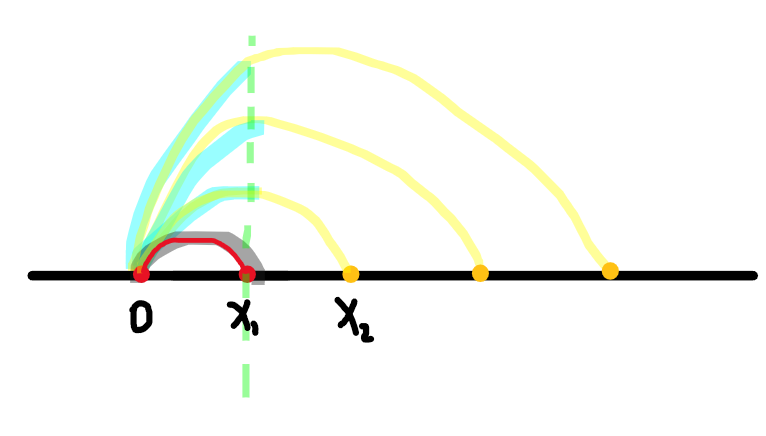

比赛链接：https://codeforces.com/contest/1659

官方题解：https://codeforces.com/blog/entry/100938

## A. Red Versus Blue

https://codeforces.com/contest/1659/problem/A

### 题目大意

求一个含有$r$个’R'和$b$个'B'的字符串使得最大连续字母数最少。$$(3≤n≤100,  1≤b<r≤n, r+b=n).$$

### 题解

注意思考方法，写的时候写复杂了

$b$个'B'会分出$b+1$个空间放‘R'，只需要把r个'R'平均放在$b+1$个空隙中就可以了。

```c++
#include <iostream>
#include <cstdio>
#include <string>
using namespace std;
int main() {
  int T; cin >> T;
  while(T--) {
    int n, r, b; 
    cin >> n >> r >> b;
    int p = r / (b + 1), q = r % (b + 1);
    for (int i = 1; i <= q; i++)
      cout << string(p+1, 'R') << 'B';
    for (int i = q+1; i <= b; i++)
      cout << string(p, 'R') << 'B';
    cout << string(p, 'R') << endl;
  }
  return 0;
}
```

比赛时候的代码

```c++
#include <iostream>
#include <cstdio>
#include <cstring>
using namespace std;
const int MAXN = 500;
char s[MAXN];
int main() {
  int T; scanf("%d", &T);
  while(T--) {
    int n, r, b; scanf("%d%d%d", &n, &r, &b);
    for (int i = 1; i <= r; i++) {
      int num = r/i - (r%i==0);
      if (i == 1) num = r-1;
      
      if (num > b) continue;      
 
      int numb = b, cnt = 0;
      for (int j = 1; j <= r; j++)  {
        s[++cnt] = 'R';
        if (numb && j%i==0) 
          s[++cnt] = 'B', numb--;
      }
      for (int j = 1; j <=cnt; j++) {
        printf("%c", s[j]);
        if (((s[j] == 'R' && s[j+1] == 'R') || j == cnt || j == 1) && numb)
          printf("B"), numb--;
      }
      printf("\n");
      break;
    }
  }
  return 0;
}
```


## B. Bit Flipping

https://codeforces.com/contest/1659/problem/B

简单题

```c++
#include <iostream>
#include <cstdio>
#include <cstring>
using namespace std;
 
const int MAXN = 200005;
char s[MAXN];
int b[MAXN];
 
char chg(char ch) {
  return ch=='1'? '0': '1';
}
int main() {
  int T; scanf("%d", &T);
  while (T--) {
    int n, K; scanf("%d%d", &n, &K);
    scanf("%s", s+1);
    for (int i = 1; i <= n; i++) {
      if (K&1) s[i] = chg(s[i]);
      b[i] = 0;
    }
 
    for (int i = 1; i <= n; i++) 
      if (K && s[i]=='0') {
        s[i] = chg(s[i]);
        K--; b[i]++;
      } 
    if (K) {
      b[1] += K - K%2;
      if (K%2) {
        s[n] = chg(s[n]);
        b[n]++;  
      }
    }
    s[n+1] = '\0';
    printf("%s\n", s+1);
    for (int i = 1; i <= n; i++)
        printf("%d ", b[i]);
    printf("\n");
  }
  return 0;
}
```

## C. Line Empire

https://codeforces.com/contest/1659/problem/C

### 题目大意

数轴上n个点代表其他国家，你的国家首都在O点，占领一个国家花费$b*|c_1 - c_2|$即a*首都与一个国家的距离，迁都花费$a * |c_1-c_2|$，占领国家必须连续，求占领全部国家最小花费。

$(1≤n≤2⋅10^5; 1≤a,b≤10^5)$

### 题解

思维题，思考方向对了就没问题。

考虑两种情况

- $a < b$，这时候迁都的费用要更小，


如上图所示，目前已经攻占了$x_1$,那么攻占$x_2$时要不要迁都到$x_1$呢？显然是要的，因为两种方案中，两段的费用$0->x_1, x_1->x_2$中第二段的费用是固定的，而第一段迁都的费用是要更低的，且迁都也更利于后续的点。

所以在此种情况下，除了最后一个点，攻占一个点便要迁都一次

- $a > b$，这时候攻打的费用要更低

那我们能不能一直攻打而不迁都呢？

答案也是不可以，例如下图

是一种不迁都的情况，从O点开始要攻占四个点，不迁都时的攻打方案是黄色线，此时在$0->x_1$段要花费四倍的攻占费用，如果攻占完$x_1$之后立马迁都，那么在$0->x_1$段将花费的是1倍攻占费用以及1倍迁都费用。

如何决定是否迁都呢？只要此时1倍的迁都费用小于3倍的攻占费用，即$a < 3*b$，那么就要迁都。

所以我们只需要求出a和b的倍数关系，就可以求出首都之后存在多少点时需要迁都。也是一种贪心策略。

具体见代码

```c++
#include <cstdio>
#include <cstring>
#include <iostream>
using namespace std;
typedef long long LL;
int main() {
  int T; scanf("%d", &T);
  while(T--) {
    int n; LL a, b; 
    scanf("%d%lld%lld", &n, &a, &b);
    LL ans = 0, last_pos = 0;
    for (int i = 1; i <= n; i++) {
      LL x; scanf("%lld", &x);
      if (b <= a) {
        ans += b * (x - last_pos);

        int num = a/b + 1;
        if (n - i >= num) {
          ans += a * (x - last_pos);
          last_pos = x;
        }
      } else {
        ans += b * (x - last_pos);
        if (i != n) ans += a * (x - last_pos);
        last_pos = x;
      }
    }
    printf("%lld\n", ans);
  }
  return 0;
}
```