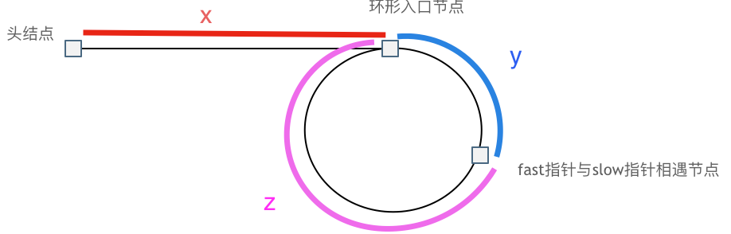

## 142.环形链表II

[力扣题目链接(opens new window)](https://leetcode.cn/problems/linked-list-cycle-ii/)

题意： 给定一个链表，返回链表开始入环的第一个节点。 如果链表无环，则返回 null。

为了表示给定链表中的环，使用整数 pos 来表示链表尾连接到链表中的位置（索引从 0 开始）。 如果 pos 是 -1，则在该链表中没有环。

**说明**：不允许修改给定的链表。


创建fast和slow两个指针，fast每次走两步，slow每次走一步，若有环最终会相遇。

如何寻找最终位置？



可以证明$x = z$，在头节点和相遇处放置两个指针，然后一步一步走完就可以找到入口

```ruby
# Definition for singly-linked list.
# class ListNode
#     attr_accessor :val, :next
#     def initialize(val)
#         @val = val
#         @next = nil
#     end
# end

# @param {ListNode} head
# @return {ListNode}
def detectCycle(head)
    fast, slow = head, head
    while fast != nil && fast.next != nil
        slow = slow.next
        fast = fast.next.next
        if slow == fast
            p1, p2 = head, slow
            while p1 != p2; p1, p2 = p1.next, p2.next; end
            return p1
        end
    end
    return nil
end
```

